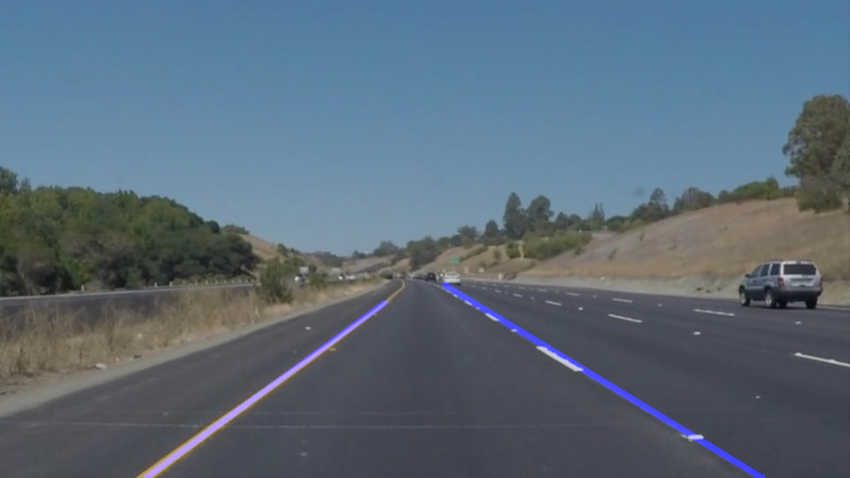

#**Finding Lane Lines on the Road** 

Overview
---
This repo was created as a submission to the first project of Lane finding for the Udacity Autonomous Car nanodegree programs.

When we drive, we use our eyes to decide where to go.  The lines on the road that show us where the lanes are act as our constant reference for where to steer the vehicle.  Naturally, one of the first things we would like to do in developing a self-driving car is to automatically detect lane lines using an algorithm.

You will find the following files in this gti repository.
1) Processed Images - Images run through Code present in P1_Main
2) test_Images - contains raw images meant for processing
3) test_videos - contains raw videos meant for processing
4) test_video_output - processed video run through P1_Main
5) P1.ipynb - initial code template given
6) P1_Main.ipynb  - Modified and Final Code for processing.
7) Writeup - write up for project rubric ( in both pdf and docx formats)
